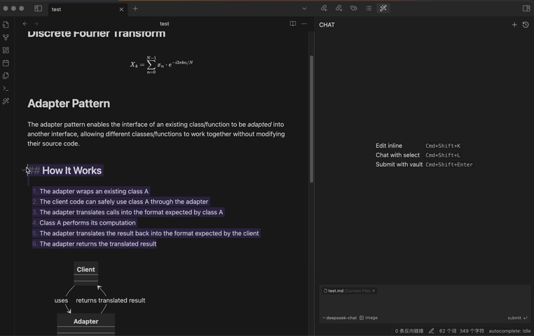
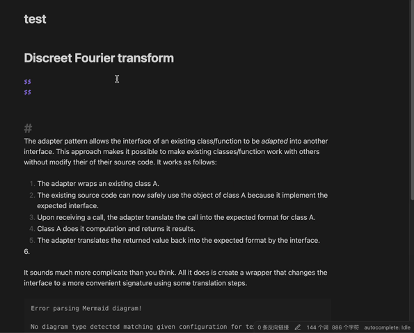
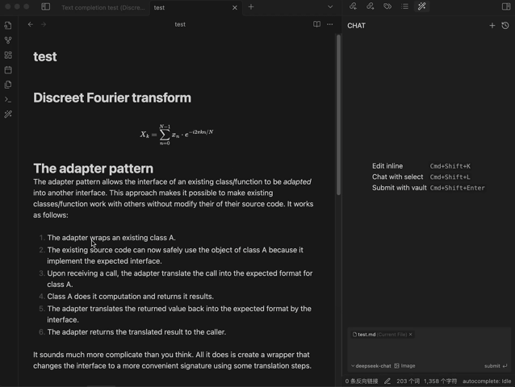
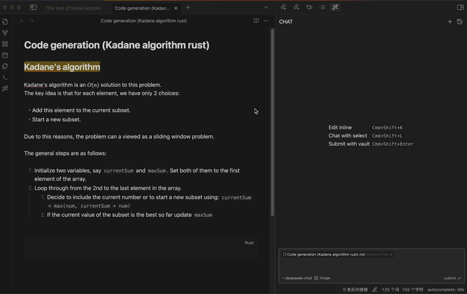

<h1 align="center">Infio-Copilot</h1>

**Infio-Copilot is a Cursor-inspired AI assistant for Obsidian that offers smart autocomplete and interactive chat with your selected notes**

## Features

### Chat & Edit Flow

Get instant AI assistance and apply suggested improvements with a single click, all within Obsidian

### Autocomplete

Receive context-aware writing suggestions as you type

### Inline Editing

Edit your notes directly within the current file

### chat with vault 

Leverage the power of AI to interact with your entire Obsidian vault, gaining insights and connections across your notes

## Getting Started

> **⚠️ Important: Installer Version Requirement**Infio-Copilot requires a recent version of the Obsidian installer. If you experience issues with the plugin not loading properly:
>
> 1. First, try updating Obsidian normally at `Settings > General > Check for updates`.
> 2. If issues persist, manually update your Obsidian installer:
>
>    - Download the latest installer from [Obsidian&#39;s download page](https://obsidian.md/download)
>    - Close Obsidian completely
>    - Run the new installer

1. Open Obsidian Settings
2. Navigate to "Community plugins" and click "Browse"
3. Search for "Infio Copilot" and click Install
4. Enable the plugin in Community plugins
5. Set up your API key in plugin settings
   - DeepSeek : [DeepSeek API Keys](https://platform.deepseek.com/api_keys/)
   - OpenAI : [ChatGPT API Keys](https://platform.openai.com/api-keys)
   - Anthropic : [Claude API Keys](https://console.anthropic.com/settings/keys)
   - Gemini : [Gemini API Keys](https://aistudio.google.com/apikey)
   - Groq : [Groq API Keys](https://console.groq.com/keys)

## Feedback and Support
We value your input and want to ensure you can easily share your thoughts and report any issues:

- **Bug Reports**: If you encounter any bugs or unexpected behavior, please submit an issue on our [GitHub Issues](https://github.com/infiolab/infio-copilot/issues) page. Be sure to include as much detail as possible to help us reproduce and address the problem.
- **Feature Requests**: For new feature ideas or enhancements, please use our [GitHub Discussions - Ideas &amp; Feature Requests](https://github.com/infiolab/infio-copilot/discussions/categories/ideas) page. Create a new discussion to share your suggestions.
·## License

This project is licensed under the [MIT License](LICENSE).
