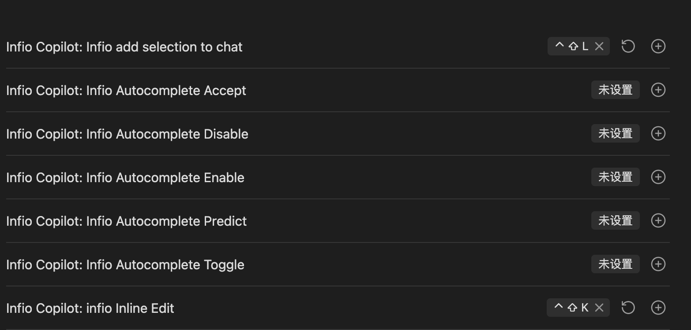

<h1 align="center">Infio-Copilot</h1>

**Infio-Copilot 是一个受 Cursor 启发的 Obsidian AI 助手，为您的笔记提供智能自动补全和交互式对话功能**

[English Version](README.md)

## 功能特点

### 对话与编辑流程

在 Obsidian 中获取即时 AI 辅助，并一键应用建议的改进

### 自动补全

在您输入时获取上下文感知的写作建议

### 内联编辑

直接在当前文件中编辑您的笔记

### 与知识库对话

利用 AI 的力量与您的整个 Obsidian 知识库进行交互，获取跨笔记的见解和联系

## 开始使用

> **⚠️ 重要提示：安装程序版本要求**
> Infio-Copilot 需要较新版本的 Obsidian 安装程序。如果您遇到插件无法正常加载的问题：
>
> 1. 首先，尝试在 `设置 > 通用 > 检查更新` 中正常更新 Obsidian。
> 2. 如果问题仍然存在，手动更新您的 Obsidian 安装程序：
>
>    - 从 [Obsidian 下载页面](https://obsidian.md/download) 下载最新安装程序
>    - 完全关闭 Obsidian
>    - 运行新的安装程序

1. 打开 Obsidian 设置
2. 导航至"社区插件"并点击"浏览"
3. 搜索 "Infio Copilot" 并点击安装
4. 在社区插件中启用该插件
5. 在插件设置中配置您的 API 密钥
   - DeepSeek：[DeepSeek API Keys](https://platform.deepseek.com/api_keys/)
   - OpenAI：[ChatGPT API Keys](https://platform.openai.com/api-keys)
   - Anthropic：[Claude API Keys](https://console.anthropic.com/settings/keys)
   - Gemini：[Gemini API Keys](https://aistudio.google.com/apikey)
   - Groq：[Groq API Keys](https://console.groq.com/keys)
6. 设置快捷键以快速访问：
   - 转到 设置 > 快捷键
   - 搜索 "Infio Copilot"
   - 推荐的快捷键绑定：
     * Infio Copilot: Infio add selection to chat -> cmd + shift + L
     * Infio Copilot: Infio Inline Edit -> cmd + shift + K

## 反馈与支持
我们重视您的意见，并希望确保您能轻松分享想法和报告问题：

- **错误报告**：如果您遇到任何错误或意外行为，请在我们的 [GitHub Issues](https://github.com/infiolab/infio-copilot/issues) 页面提交问题。请确保包含尽可能多的细节，以帮助我们重现和解决问题。
- **功能请求**：对于新功能想法或改进建议，请使用我们的 [GitHub Discussions - Ideas & Feature Requests](https://github.com/infiolab/infio-copilot/discussions/categories/ideas) 页面。创建新的讨论来分享您的建议。

## 致谢

本项目站在巨人的肩膀上。我们要向以下开源项目表示感谢：

- [obsidian-copilot-auto-completion](https://github.com/j0rd1smit/obsidian-copilot-auto-completion) - 提供自动补全实现和 TypeScript 架构灵感
- [obsidian-smart-composer](https://github.com/glowingjade/obsidian-smart-composer) - 提供聊天/应用 UI 模式和 PgLite 集成示例
- [continue](https://github.com/continuedev/continue) & [cline](https://github.com/cline/cline) - 提供提示工程和 LLM 交互模式
- [pglite](https://github.com/electric-sql/pglite) - 提供对话/向量数据存储和示例代码

## 许可证

本项目采用 [MIT 许可证](LICENSE) 授权。
